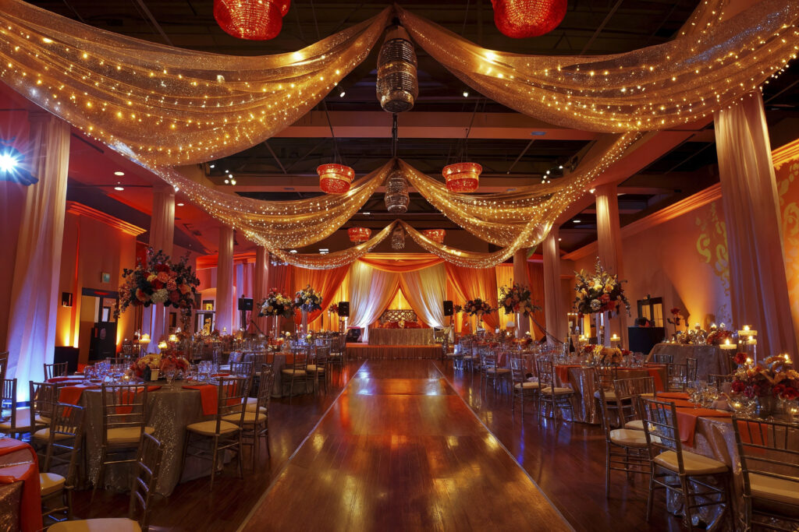

# Event Planner Website

A modern, responsive event planning website built with HTML, CSS, and JavaScript. This elegant platform showcases event planning services with a professional design and smooth animations.

## 🌟 Features

- **Responsive Design** - Fully responsive layout that works seamlessly on desktop, tablet, and mobile devices
- **Modern UI/UX** - Clean and professional interface with smooth interactions
- **AOS Animations** - Beautiful scroll animations using Animate On Scroll (AOS) library
- **Multiple Service Offerings** - Showcase wedding planning, corporate events, birthday parties, and private celebrations
- **Pricing Packages** - Three-tier pricing model (Basic, Premium, Luxury) with detailed features
- **Client Testimonials** - Display customer reviews with star ratings
- **Gallery Section** - Showcase past event work in an elegant grid layout
- **Smooth Navigation** - Sticky navigation bar with smooth scrolling to sections
- **Font Awesome Icons** - Professional icons for visual enhancement

## 📁 Project Structure

```
event-planner/
│
├── index.html          # Main HTML file
├── style.css           # All styling and responsive design
├── images/             # Image assets folder
│   ├── ev1.jpg
│   ├── wedding.jpg
│   ├── corporateEve.jpg
│   ├── bdayEve.jpg
│   ├── private.jpg
│   ├── eve1.png
│   ├── eve2.jpg
│   ├── eve3.webp
│   ├── eve4.jpg
│   ├── eve5.jpg
│   ├── eve6.avif
│   ├── user1.png
│   ├── user2.png
│   └── user3.png
│
└── README.md           # This file
```

## 🛠️ Technologies Used

- **HTML5** - Semantic markup for better structure
- **CSS3** - Advanced styling with flexbox and grid layouts
- **JavaScript** - AOS library for scroll animations
- **Font Awesome 6.5.1** - Icon library via CDN
- **AOS (Animate On Scroll)** - Scroll-triggered animation library

## 📋 Sections Overview

### 1. **Navbar**
- Logo and branding
- Navigation links (Home, Services, Gallery, Packages, Testimonials, Contact)
- "Book Event" call-to-action button

### 2. **Hero Section**
- Eye-catching headline with gradient text
- Compelling description
- Dual CTAs: "Get Started" and "View Packages"
- Featured event image with subtle blur effect

### 3. **Services Section**
- Four service cards showcasing different event types:
  - Wedding Planning
  - Corporate Events
  - Birthday Parties
  - Private Celebrations

### 4. **Planning Process Section**
- Three-step process visualization:
  1. Share Your Idea
  2. We Organize Everything
  3. Enjoy Your Event

### 5. **Gallery Section**
- 6-image grid layout showcasing past events
- Hover zoom effect for interactivity
- Responsive grid (3 columns on desktop, 2 on tablet, 1 on mobile)

### 6. **Packages Section**
- Three pricing tiers:
  - **Basic** - $1500/starting
  - **Premium** - $3800/starting
  - **Luxury** - $7500/starting
- Feature lists for each package
- Call-to-action buttons

### 7. **Testimonials Section**
- Three customer testimonials
- 5-star ratings
- Client images and names
- Roles/contexts (Wedding Client, CEO, Private Client)

### 8. **Footer**
- Company description
- Quick links
- Contact information (address, phone, email)
- Copyright notice

## 🎨 Design Features

### Color Scheme
- **Primary Color**: Purple (`#800080`, `#4b0082`)
- **Secondary Colors**: White, Light Gray (`#f9f9f9`, `#f0f0f0`)
- **Text Colors**: Dark gray (`#555`), Slate gray (`slategray`)
- **Accent**: Goldenrod (for star ratings)

### Typography
- **Font Family**: System fonts (system-ui, -apple-system, sans-serif)
- **Responsive Font Sizes**: Adjusts from 56px on desktop to 36px on mobile

### Spacing & Layout
- **Container Max-Width**: 1200px
- **Padding**: 80px for sections, 20px for responsive padding
- **Gap/Spacing**: 15-50px depending on context
- **Border Radius**: 8-22px for modern rounded corners

## 📱 Responsive Breakpoints

```css
/* Tablet: max-width 992px */
- 2-column gallery grid
- Adjusted hero layout

/* Mobile: max-width 600px */
- Stack all flex layouts vertically
- Single column gallery grid
- Collapsed navbar
- Adjusted font sizes
```

## 🚀 Getting Started

### Prerequisites
- A modern web browser (Chrome, Firefox, Safari, Edge)
- A local web server (optional, for development)

### Installation

1. **Clone or download** the project files to your local machine
2. **Organize the folder structure**:
   - Place `index.html` in the root directory
   - Place `style.css` in the root directory
   - Create an `images` folder and add all image assets
3. **Open in browser**: Double-click `index.html` or serve via a local server

### Local Server Setup (Optional)
If using Python:
```bash
python -m http.server 8000
```

Then visit `http://localhost:8000` in your browser.

## 🎯 How to Customize

### Update Content
1. **Navbar Links**: Edit the `href` attributes in `.navbar-links`
2. **Service Cards**: Modify text in `.service-card` elements
3. **Pricing**: Update prices and features in `.package-card` sections
4. **Testimonials**: Replace client quotes and images

### Replace Images
Replace image paths in the `src` attributes:
```html
<!-- Old -->


<!-- New -->

```

**Note**: Fix the current typo `imgaes` → `images` in all image paths

### Modify Colors
Update the CSS color values:
```css
/* Primary color */
.btn-primary {
  background-color: purple; /* Change this */
}
```

### Adjust Animations
Modify AOS attributes in HTML:
```html
<div data-aos="fade-right" data-aos-duration="1000">
```

**Available animations**: `fade-right`, `fade-left`, `fade-down`, `fade-up`, `flip-up`, `flip-down`, `zoom-out`

## 📦 External Libraries

### Font Awesome
Provides icons for social media and contact information.
- CDN: `https://cdnjs.cloudflare.com/ajax/libs/font-awesome/6.5.1/css/all.min.css`

### AOS (Animate On Scroll)
Triggers animations when elements scroll into view.
- CSS: `https://unpkg.com/aos@2.3.4/dist/aos.css`
- JS: `https://unpkg.com/aos@2.3.4/dist/aos.js`
- Documentation: [AOS Docs](https://michalsnik.github.io/aos/)

## 🔗 Links & Navigation

The navbar includes smooth scrolling to sections using anchor links:
- `#services` - Services section
- `#packages` - Packages section
- `#testimonials` - Testimonials section
- `#gallery` - Gallery section
- `#planing` - Planning process section

## 📧 Contact Information

Default contact details in footer:
- **Address**: 123 Luxury Avenue, Penthouse B, New York, NY 10001
- **Phone**: +1 (555) 000-1234
- **Email**: hello@eliteplan.com

Update these in the footer section as needed.

## 🐛 Known Issues & Fixes

1. **Image Folder Typo**: All image paths use `./imgaes/` instead of `./images/`
   - **Fix**: Rename folder to `images` and update all `src` attributes

2. **Missing Images**: Ensure all referenced image files exist in the images folder

3. **Navigation Links**: Some navbar links (Home, Gallery, Contact) don't have corresponding IDs
   - **Fix**: Add `id="home"`, `id="gallery"`, `id="contact"` to respective sections

## 🌐 Browser Support

- Chrome (Latest)
- Firefox (Latest)
- Safari (Latest)
- Edge (Latest)
- Mobile browsers (iOS Safari, Chrome Mobile)

## 📈 Future Enhancements

- [ ] Add contact form with backend validation
- [ ] Implement booking system
- [ ] Add image carousel for gallery
- [ ] Create admin dashboard for content management
- [ ] Implement SEO optimization
- [ ] Add dark mode toggle
- [ ] Integrate email notifications
- [ ] Add payment gateway integration

## 📄 License

This project is created for educational and commercial purposes. Feel free to modify and use as needed.

## 👨‍💻 Author

Event Planner Website
- Website: [eliteplan.com](mailto:hello@eliteplan.com)
- Company: Elite Events

## 📞 Support

For support or inquiries, contact:
- Email: hello@eliteplan.com
- Phone: +1 (555) 000-1234

## 🙏 Acknowledgments

- Font Awesome for icons
- AOS library for scroll animations
- Modern CSS practices and responsive design patterns

---

**Last Updated**: 2026
**Version**: 1.0.0
